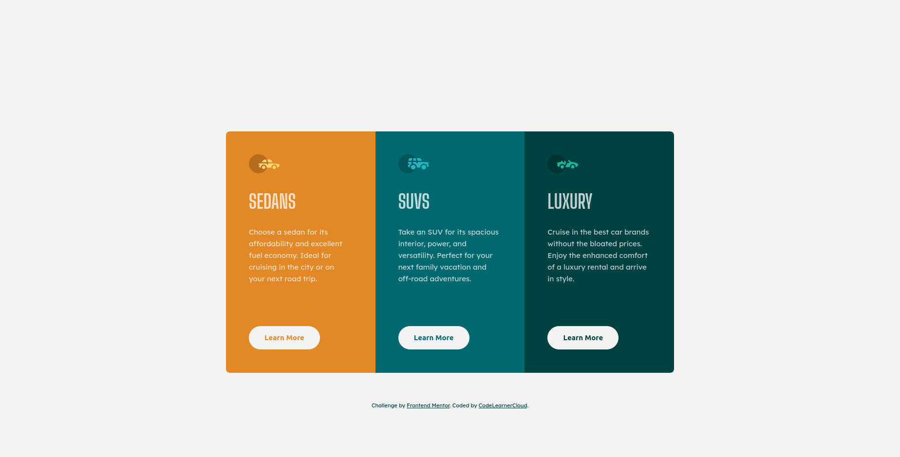

# Frontend Mentor - 3-column preview card component solution

This is a solution to the [3-column preview card component challenge on Frontend Mentor](https://www.frontendmentor.io/challenges/3column-preview-card-component-pH92eAR2-).

## Table of contents

- [Overview](#overview)
  - [Screenshot](#screenshot)
  - [Links](#links)
- [My process](#my-process)
  - [Built with](#built-with)
  - [Useful resources](#useful-resources)
- [Author](#author)

## Overview

### Screenshot

### Links

- Solution URL: [Github](https://github.com/CodeLearnerCloud/3-column-preview-card-component)
- Live Site URL: [Netlify](https://frosty-jennings-6d04aa.netlify.app/)

## My process

### Built with

- Semantic HTML5 markup
- CSS custom properties
- Flexbox
- Mobile-first workflow

### Useful resources

- [Anosha Ahmed](https://github.com/anoshaahmed/3-column-preview-card) - This helped me for Style. I really liked this pattern and will use it going forward.

## Author

- Website - [CodeLearnerCloud](https://github.com/CodeLearnerCloud)
- Frontend Mentor - [@CodeLearnerCloud](https://www.frontendmentor.io/profile/CodeLearnerCloud)

